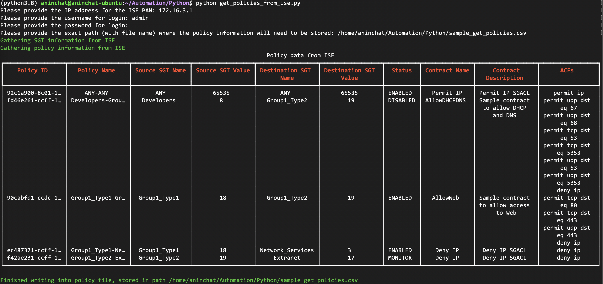

# retrieve_cisco_ise_policies

This script is built to retrieve all policy information from ISE and store it in an easily consumable .csv file. A sample csv file is added to this repo as well as an example ('sample_get_ise_policies.csv'). Sample run of the script:

